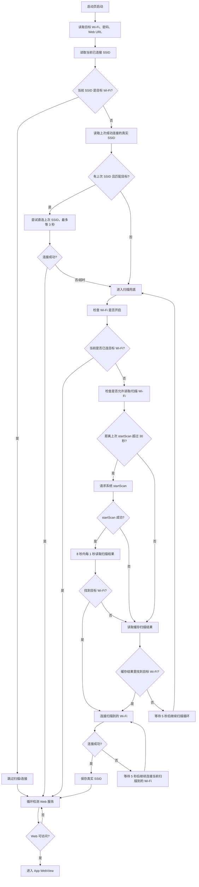

```mermaid
flowchart TD
    A["启动页启动"] --> B["读取目标 Wi-Fi、密码、Web URL"]

    B --> C["读取当前已连接 SSID"]
    C --> D{"当前 SSID 是目标 Wi-Fi?"}

    D -- "是" --> E["跳过扫描/连接"]
    E --> F["循环检测 Web 服务"]
    F --> G{"Web 可访问?"}
    G -- "是" --> H["进入 App WebView"]
    G -- "否" --> F

    D -- "否" --> I["读取上次成功连接的真实 SSID"]
    I --> J{"有上次 SSID 且匹配目标?"}

    J -- "是" --> K["尝试直连上次 SSID，最多等 3 秒"]
    K --> L{"连接成功?"}
    L -- "是" --> F
    L -- "否/超时" --> M["进入扫描兜底"]

    J -- "否" --> M

    M --> N["检查 Wi-Fi 是否开启"]
    N --> O{"当前是否已连目标 Wi-Fi?"}
    O -- "是" --> F

    O -- "否" --> P["检查是否允许读取/扫描 Wi-Fi"]
    P --> Q{"距离上次 startScan 超过 30 秒?"}

    Q -- "是" --> R["请求系统 startScan"]
    R --> S{"startScan 成功?"}
    S -- "是" --> T["8 秒内每 1 秒读取扫描结果"]
    T --> U{"找到目标 Wi-Fi?"}
    U -- "是" --> V["连接扫描到的 Wi-Fi"]
    U -- "否" --> W["读取缓存扫描结果"]

    S -- "否" --> W
    Q -- "否" --> W

    W --> X{"缓存结果里找到目标 Wi-Fi?"}
    X -- "是" --> V
    X -- "否" --> Y["等待 5 秒后继续扫描循环"]
    Y --> M

    V --> Z{"连接成功?"}
    Z -- "是" --> AA["保存真实 SSID"]
    AA --> F
    Z -- "否" --> AB["等待 5 秒后继续连接当前扫描到的 Wi-Fi"]
    AB --> V
```
